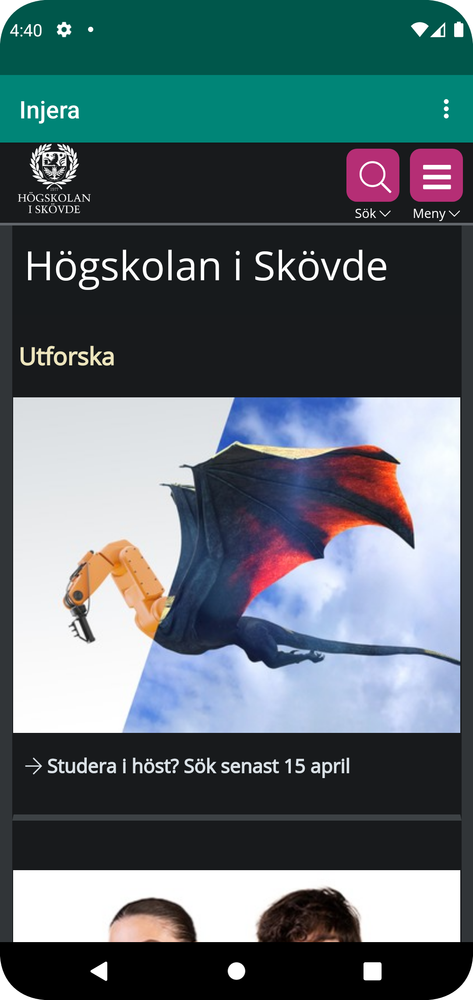
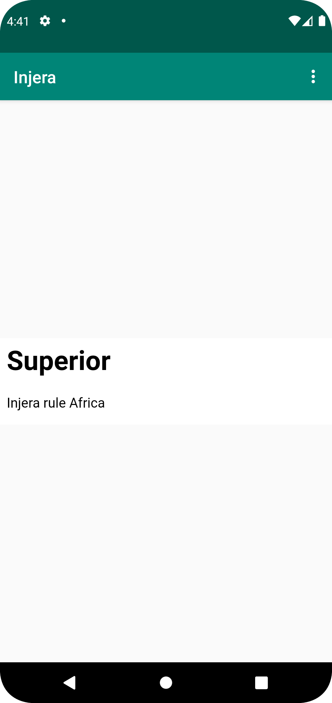

# Rapport

Ändrade namnet till Injera genom att byta namnet på stringen i strings.xml. 
Tillät internet åtkomst för appen genom att lägga till en kodsnutt i androidmanifest.xml. 
Tog bort textview och ersatte den med webview element tillsammans lades ett id i den. 
Skapade en privat medlemsvariabel kallas mywebview och instansiera den med den med dess id. 
Tillät javascript exekvering genom att importera websettings. 
Skapade en extern webbplats med loadurl tillsammans med länk och ett internt genom att skapa en assets folder och 
kallat den i en load med file:///android_asset/...

```
 private WebView myWebView;
 
    public void showExternalWebPage(){
        myWebView.loadUrl("https:///his.se");
    }

    public void showInternalWebPage(){
        myWebView.loadUrl("file:///android_asset/about.html");
    }
    
    myWebView = findViewById(R.id.my_webview);
    myWebView.setWebViewClient(new WebViewClient()); // Do not open in Chrome!
    WebSettings webSettings = myWebView.getSettings();
    webSettings.setJavaScriptEnabled(true);
    myWebView.loadUrl("file:///android_asset/about.html");
    ...
    if (id == R.id.action_external_web) {
       Log.d("==>","Will display external web page");
       showExternalWebPage();
       return true;
    }

    if (id == R.id.action_internal_web) {
       Log.d("==>","Will display internal web page");
       showInternalWebPage();
       return true;
    }
```





